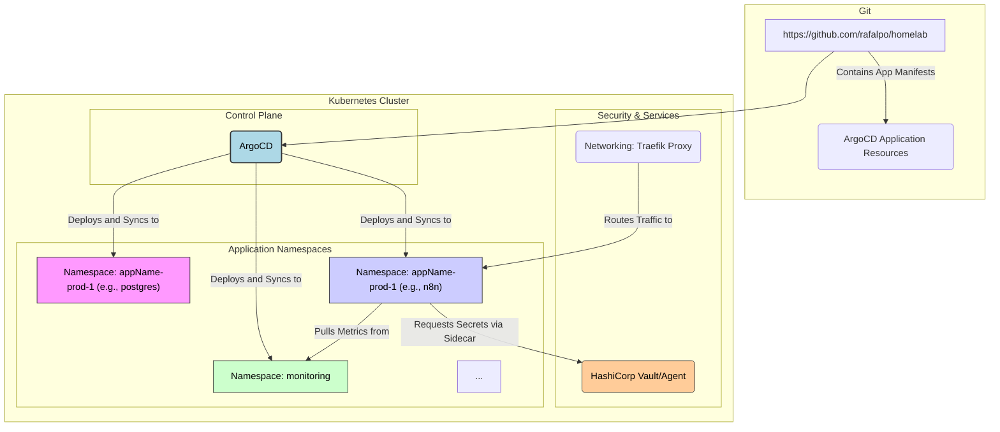

# HomeLab Infrastructure-as-Code (IaC) - Kubernetes Cluster Configuration

This repository documents the services and configurations deployed on my self-hosted Kubernetes cluster within my personal **HomeLab**, all managed and deployed via ArgoCD. It is the centralized **Source of Truth** for my infrastructure-as-a-code setup.

## What is a HomeLab?

A **HomeLab** is a personal, private IT infrastructure environment set up at home. It serves as a place for learning, experimentation, and running personal services. It often consists of various hardware (servers, networking gear) and software components (virtual machines, containers, operating systems).

The Kubernetes cluster documented here is a **crucial component** of my HomeLab, but it is not the entirety of it. My broader HomeLab setup includes physical servers, virtualization provider, bare metal servers, with the Kubernetes cluster providing a scalable and declarative platform for deploying containerized applications.

## Deployment and Naming Conventions (Principles)

The following principles guide the deployment and organization of applications within the Kubernetes cluster:

* **Source of Truth (GitOps):** This repository is the sole **Source of Truth** for the desired state of the cluster. ArgoCD is responsible for continuous synchronization.
* **Application Namespacing:** Every non-monitoring application will be deployed into its own dedicated Kubernetes Namespace.
* **Namespace Naming Scheme (Non-Monitoring):** All application Namespaces will adhere to the naming scheme: `<appName>-prod-1` (e.g., `traefik-prod-1`, `argocd-prod-1`, `vault-prod-1`).
* **Monitoring Namespacing:** All observability and monitoring components will reside within a single Namespace named `monitoring`.

## Key Tools and Technologies

The following key technologies are used to manage, deploy, and secure the applications within this Kubernetes cluster:

### ArgoCD (GitOps Controller)

**ArgoCD** is a declarative, GitOps continuous delivery tool for Kubernetes. It is the core mechanism used to deploy and maintain the state of the applications defined in this repository.

* **Role:** It continuously monitors this [Git repository](https://github.com/rafalpo/homelab) for any changes to the desired application state (manifests, Helm charts, Kustomize files).
* **Function:** If the live state in the cluster drifts from the state defined in Git, ArgoCD automatically synchronizes the cluster to match the Git repository, ensuring the infrastructure is always aligned with the defined configuration—the **Source of Truth**.

### HashiCorp Vault (via Vault Agent)

**HashiCorp Vault** is a tool for securely accessing secrets. It provides a unified interface to any secret, while providing strict access control and recording a detailed audit log.

* **Role:** While the core Vault server may run outside or inside the cluster, this setup primarily leverages the **Vault Agent**.
* **Function:** The **Vault Agent Sidecar Injector** automatically injects a sidecar container into specific application Pods. This sidecar handles the secure retrieval of secrets (API keys, database credentials, etc.) from Vault and securely delivers them to the application container, ensuring that sensitive data is never hardcoded in Kubernetes manifests or stored unencrypted in this repository.

### Traefik Proxy (Reverse Proxy/Ingress Controller)

**Traefik Proxy** acts as the modern HTTP reverse proxy and load balancer.

* **Role:** It serves as the Ingress Controller for the cluster, dynamically routing external HTTP/HTTPS traffic to the correct internal services based on IngressRoute definitions.
* **Function:** Traefik simplifies application exposure and TLS termination.

## Cluster Application Architecture Overview

The following diagram illustrates the relationship between key components and how applications interact with the control plane and security tools.

